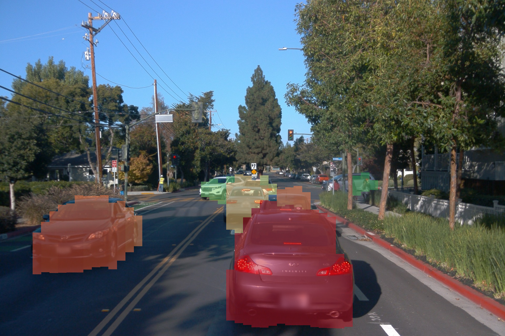
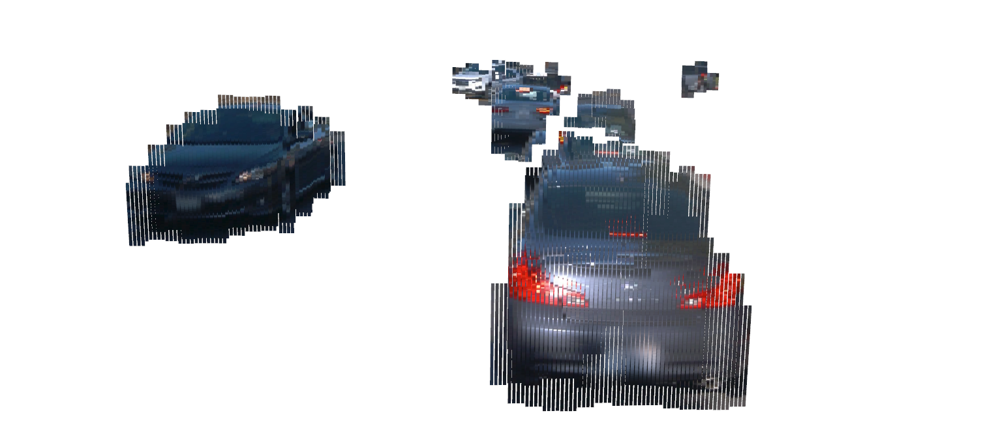
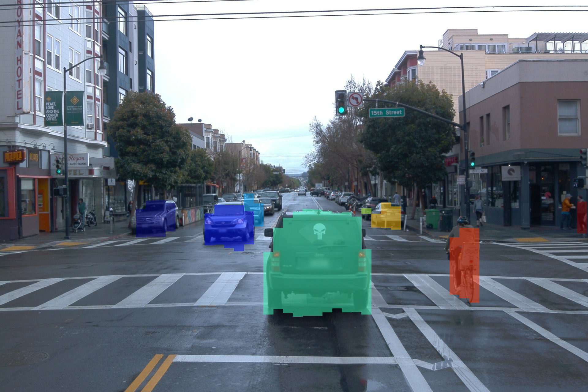
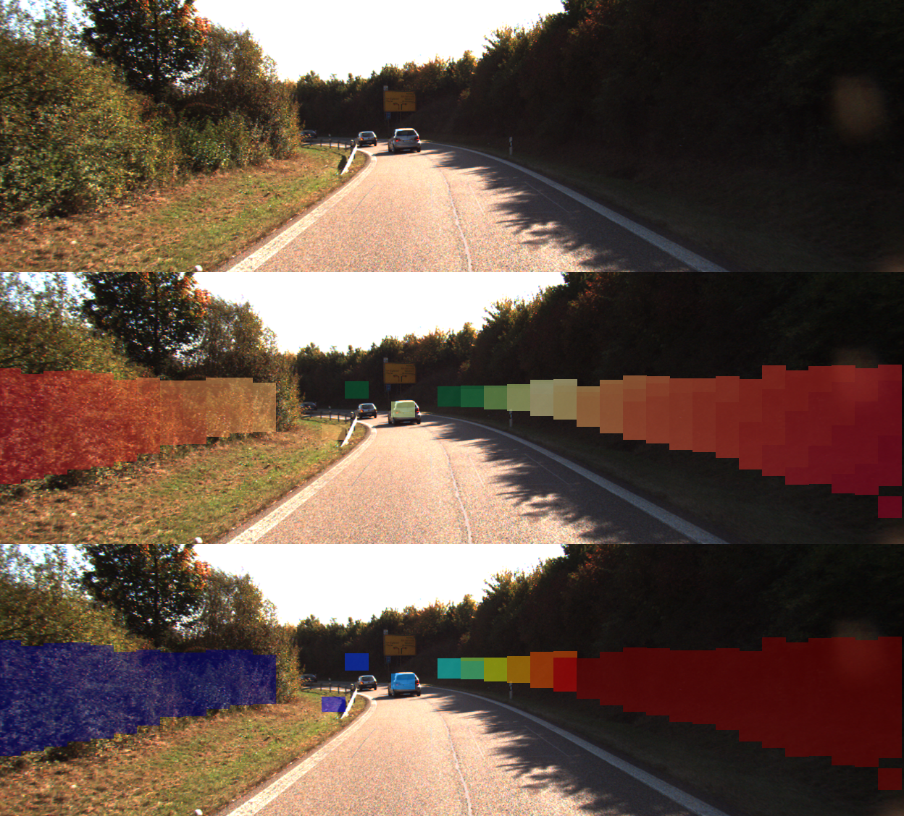

# **StixelNExT++**

📢 **INFO:** This repository will be fully published upon the official publication announcement.

---

## 🚀 **Sneak Preview**

**StixelNExT++** introduces a novel approach to monocular scene representation, extending the **Stixel World** paradigm.
Our method infers **3D Stixels** and enhances object segmentation by clustering smaller Stixel units, creating a highly
compressed yet flexible representation for **point clouds** and **bird’s-eye-view (BEV) maps**.

### **Key Features**

✅ **Real-time performance** – Achieves inference speeds as fast as **10 ms per frame**.  
✅ **Lightweight neural network** – Trained with **automatically generated LiDAR-based ground truth - holistic and
specific**.  
✅ **Strong performance** – Evaluated on the **Waymo dataset**, delivering competitive results within a **30-meter range
**.  
✅ **Versatile applications** – Ideal for **collective perception** in autonomous systems.

---

## 📊 **Results**

Our model was evaluated on the **Waymo dataset**, focusing on **vehicles** and **pedestrians**. Image features were
extracted and projected into **metric space** using camera intrinsics. Stixels are represented by their **start and end
points in Cartesian space**.

### **Waymo Dataset – Stixel Prediction**

By clustering Stixels, we achieve competitive **object detection** performance.

### **Stixel Clustering for Object Detection**

We also trained models on the **KITTI dataset**, expanding our approach to capture all possible obstacles, including
**buildings, vegetation, and environmental structures**.

### **KITTI Dataset – Holistic Scene Representation**

---

## 🔜 **Stay Tuned!**

Demonstration Video: [Demonstration of the StixelNExT++ Neural Network Model](https://youtu.be/LADEQWUZx8U)
Preprint Paper on Arxiv: [StixelNExT++: Lightweight Monocular Scene Segmentation and Representation for Collective Perception](https://arxiv.org/abs/2507.06687)

More updates coming soon! 🚀  
